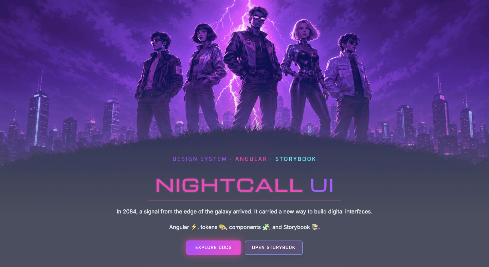

# Nightcall UI

Nightcall UI is an Angular 20 design system workspace. It contains a publishable component library, design tokens, themes, icons, shared patterns, Storybook stories, and two Angular applications.

## What is included

- A publishable Angular library under `projects/nightcall-ui`
- Shared foundations for colors, typography, motion, shadows, icons, and textures
- Reusable UI patterns for the web app and Storybook
- Documentation and demo applications
- Automated validation with Vitest, Playwright, ESLint, and Storybook builds

## Preview

<p align="center">
  
</p>

## Stack

- Angular 20
- TypeScript
- SCSS
- Angular CDK
- Angular Signals
- Standalone Components
- Storybook 9
- Style Dictionary
- CSS Custom Properties
- Vitest
- Playwright
- ESLint
- Prettier
- Husky
- lint-staged
- GitHub Actions
- ng-packagr

## Quick start

1. Install dependencies with `npm install`
2. Generate tokens with `npm run tokens`
3. Start the web app with `npm run start`
4. Start Storybook with `npm run storybook`

## Using the component library

Components are exported from `@nightcall-ui/components` as standalone Angular components:

```typescript
import { Component } from '@angular/core';
import { NcButtonComponent } from '@nightcall-ui/components';

@Component({
  selector: 'app-example',
  imports: [NcButtonComponent],
  template: '<nc-button>Save</nc-button>',
})
export class ExampleComponent {}
```

## Useful scripts

- `npm run start` – run the web app
- `npm run build` – build the web app and component library
- `npm run test` – run Vitest
- `npm run lint` – run ESLint
- `npm run storybook` – start Storybook
- `npm run build-storybook` – build the Storybook site
- `npm run tokens` – generate token outputs
- `npm run e2e` – run Playwright end-to-end tests
- `npm run format` – format the workspace with Prettier
- `npm run prepare` – install Husky hooks

## Repository structure

- `apps/docs` – Angular documentation and demo app
- `apps/web` – web experience using the shared system
- `projects/nightcall-ui` – publishable Angular package
- `libs/patterns` – shared UI patterns
- `packages/tokens` – token sources and generated outputs
- `packages/themes` – shared theme primitives
- `packages/icons` – shared icon package
- `docs` – additional documentation
